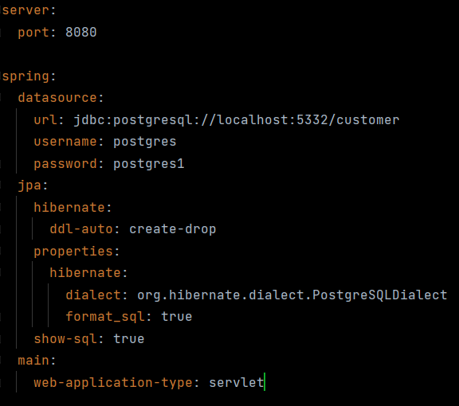
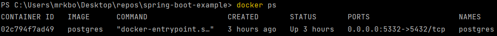
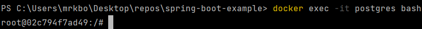
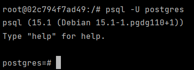

# Spring Boot 3 Playground Changelog
## Building a new project in Spring Boot 3 to adapt Web MVC, JPA, JWT and whatever else I realize I need to understand along the way.

### Day 1:

Used Spring Inilializr (https://start.spring.io/) to set up project:
- Set to Maven project, Java, Spring Boot 3.0.2, Jar, Java 17
- Made project bare-bones:
	+ deleted .mvn folder (wrapper classes). Reason being Maven is installed on my computer within IntelliJ. Otherwise this could have been left in.
	+ deleted contents of the resources folder and started a application.yml properties file
	+ rewrote main Spring Application class, standardized a greeting, set the environment up to playtest JSON using records
	+ deleted the Spring Application test within the test folder. As far as I can tell it doesn't really do anything.
- Wrote an example JSON response and used @GetMapping to set the path where it can be accessed in the browser.

---

### Day 2:

Application is set up to implement JPA. I have written a docker-compose.yml file. But now it seems I need to set up Docker. The Terminal can be found in the toolbar in the bottom of the IDE.

---

### Day 3:

Documenting the process of setting up Docker on the computer. The goal is to get it installed and runnable within the IntelliJ terminal window. I think I'm almost there.

---

### Day 4:
Docker is set up now on my machine. Had to do a lot of extra configuration to get it to run, that is now being documented in a seperate file. As such, the docker notes originally in this changelog have been migrated.

- WSL 2, and Windows Hypervisor (Hyper-V) had to be turned on in my Windows settings.
- Troubleshooted issues with docker compose and running .yml files
- WSL needed to be updated after Docker Desktop was installed
- Running the service now shows a DB instance being created

Next is to set up JDBC Driver and Spring Data JPA

Before the datasource and all the other configuration needed can be added, we need to install postgresql jdbc driver. 
> This is an open source jdbc driver written in pure java and it basically allows java programs to connect to postgresql databases using standard database independent java code.

Spring Data JPA is also dependent on this driver

- Open pom.xml
- add the following dependency below to the dependencies section
- reload the Maven project
 	

>	`<dependency>  
		<groupId>org.postgresql</groupId>  
		<artifactId>postgresql</artifactId>  
		<scope>runtime</scope>  
	</dependency>`

> the above adds the JDBC Driver for postgres.

We will use JPA which allows us to map Java Classes to Database tables and then we can use a class to directly interact with our database without having to write any SQL code. 
> Spring Data JPA is part of the largest Spring Data family, which makes it easy to implement JPA based repositories. It is a wrapper module that enhances support for JPA based Data Access Layers.

- Open pom.xml
- add the following dependency below to the dependencies section
- reload the Maven project  
>
	<dependency>
		<groupId>org.springframework.boot</groupId>
		<artifactId>spring-boot-starter-data-jpa</artifactId>
	</dependency>

> the above adds the Spring Data JPA driver.

Next is to configure the application properties
> this is done in the <code>src > main > resources > application.yml</code> file.

It is currently my understanding that indentation **is important** when writing yml configuration files.

With the above configuration file written, we try to run the application and we get this error:

`org.postgresql.util.PSQLException: FATAL: database "customer" does not exist`

Our **actual database** hasn't been created yet. Next step is to do that.

- Go into the Terminal within IntelliJ
- execute command `docker ps` to verify the containers existence  

- execute command `docker exec -it postgres` bash  

	- this will allow us to execute shell commands within the container itself. In this instance "postgres" is the name of the container
- `psql -U postgres`	
	- `psql` is the client for connecting to a postgres database
	- U is for user
	- postgres is currently the default user on my system  

To create the database we enter the command `CREATE DATABASE customer`.  
If successful, we will be returned the message `CREATE DATABASE` and given back the command prompt  

Our database is created. Next steps are to make entities.  

---

### Day 5

To establish the "customer" class as an entity we first add the `@Entity` annotation to our model class.  
Entities need ID's and these ID's need to be generated automatically in a sequence.  

The following annotations will help us set that up  
> `@Id` annotates the property below it as an ID  
`@SequenceGenerator` establishes a value generator. It requires a name and a sequence name. In this case we've named both of them `customer_id_sequence`  
`@GeneratedValue` sets up the value generation strategy. We've declared the strategy as `GenerationType.SEQUENCE` and giving it the name of our `customer_id_sequence`

Next goal is to implement the customer repository and CRUD operations.  

---

### Day 6

